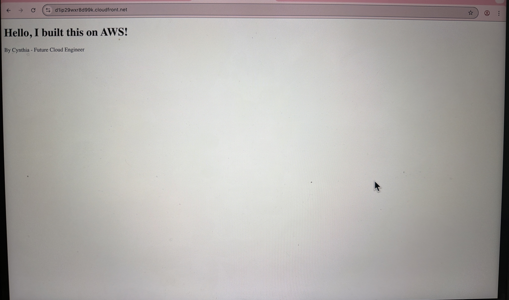
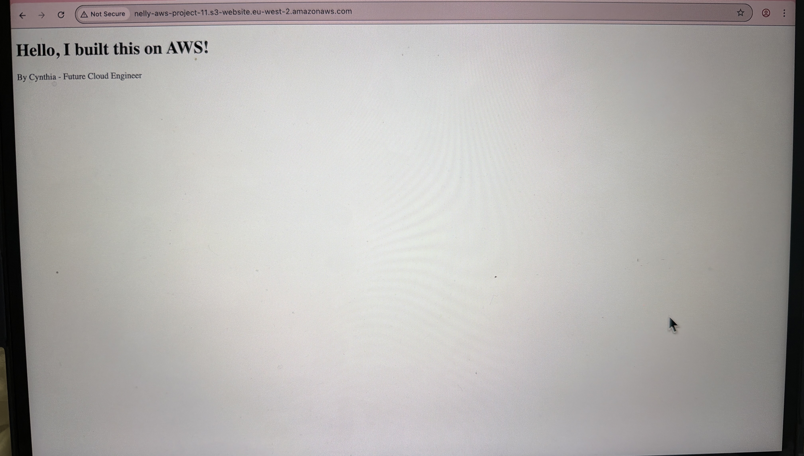
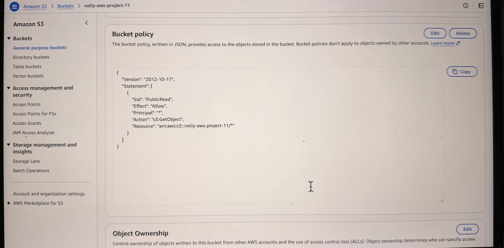
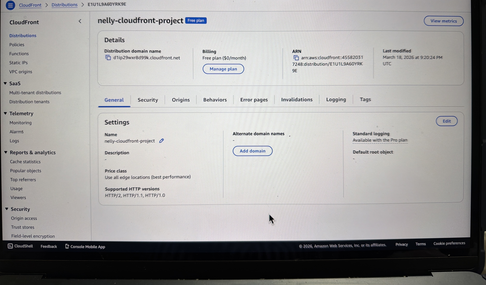

# AWS Static Website Hosting with CloudFront

## Live Demo
🚀 https://d1p29wxr8d99k.cloudfront.net

## Overview
This project demonstrates how to deploy a static website using Amazon S3 and distribute it globally using Amazon CloudFront with HTTPS enabled 

## Architecture
S3 (Origin) -> CloudFront (CDN) -> Users

## Services Used
- Amazon S3
- Amazon CloudFront
- IAM

## Key Features
- Static website hosting using S3
- Global content delivery using CloudFront
- HTTPS enabled through CloudFront
- Improved performance through caching at edge locations

## What I Did
- Created and configured an S3 bucket for static website hosting
- Uploaded website content using index.html
- Configured bucket policy for public read access
- Enabled static website hosting on the S3 bucket
- Created a CloudFront distribution
- Connected CloudFront to the S3 website endpoint
- Verified successful deployment using the CloudFront domain

## Screenshots

### Website live via CloudFront

### S3 Website Endpoint

### Bucket Policy

### Static Website Hosting Enabled

### S3 Objects

### CloudFront Distribution

## Security Note
Sensitive information has been excluded or anonymised where appropriate.
This project was completed using an IAM user rather than the AWS root account.
